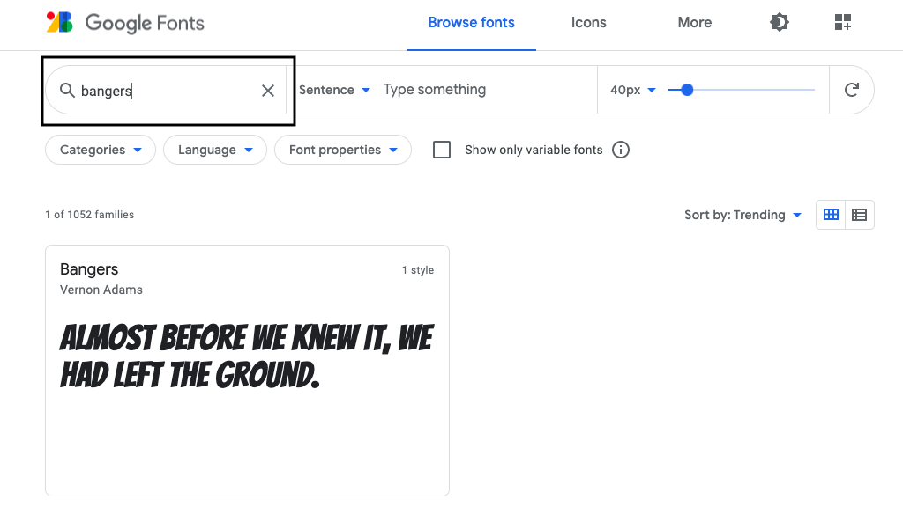
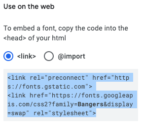

## Maak een nieuwe klasse

Laten we een stijl maken die eruitziet alsof deze uit een strip is gesneden. <a href="http://jumpto.cc/web-fonts" target="_blank">jumpto.cc/web-fonts</a> biedt een groot aantal lettertypen die gratis te gebruiken zijn.

+ Voeg een `strip` klasse toe in het **style.css** bestand. Na `magazine2` is een goede plek. Vergeet niet de punt voor de naam van de klasse. 

Maak je geen zorgen als je een waarschuwing krijgt dat 'Rule is empty' (De regel is leeg); je zult het zo meteen oplossen.

+ Voeg nu wat CSS toe aan de strip CSS-klasse. Je kunt verschillende kleuren gebruiken als je wilt. Er is een lijst met veel kleuren op <a href="http://jumpto.cc/colours" target="_blank">jumpto.cc/colours</a>.

+ Gebruik de strip stijl in een paar van de `` tags in je HTML-document en test je pagina:

+ Nu kun je een leuk lettertype toevoegen. Open een nieuw browser tabblad of -venster. Ga naar <a href="http://jumpto.cc/web-fonts" target="_blank">jumpto.cc/web-fonts</a> en zoek naar **'bangers'**:

+ Click on the + "Select this font" button:

A message saying "1 Family Selected" will appear at the bottom on the screen.

+ Click on the "1 Family Selected" message to open the window and copy the highlighted code:

+ Plak de `<link>` code die je zojuist hebt gekopieerd van Google Fonts naar `<head>` van je webpagina:

Zo kun je het lettertype Bangers op je webpagina gebruiken.

+ Keer terug naar Google Fonts en ga verder op de pagina en kopieer de font-family code onder 'Specify in CSS':

+ Ga nu terug naar je **'style.css'** bestand in je trinket en plak de font-family code in de strip stijl:

+ Test je webpagina. Het resultaat zou er ongeveer zo uit moeten zien: 

