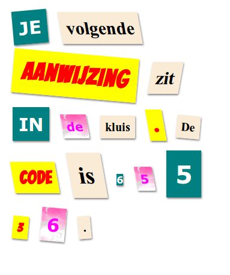

## Maak een nieuwe Class

Laten we een stijl maken die eruitziet alsof deze uit een strip is gesneden. <a href="http://jumpto.cc/web-fonts" target="_blank">jumpto.cc/web-fonts</a> biedt een groot aantal lettertypen die gratis te gebruiken zijn.

+ Voeg een `comic` klasse toe in het **style.css** bestand. Na `magazine2` is een goede plek. Vergeet niet de punt voor de class naam. 

Maak je geen zorgen als je een waarschuwing krijgt dat 'The Rule is empty' (De regel is leeg); je zult het zo meteen oplossen.

+ Voeg nu wat CSS toe aan de comic CSS-klasse. Je kunt verschillende kleuren gebruiken als je wilt. Er is een lijst met veel kleuren op <a href="http://jumpto.cc/colours" target="_blank">jumpto.cc/colours</a>.

+ Gebruik de comic stijl in enkele van de `` tags in je HTML-document en test je pagina:

+ Nu kun je een leuk lettertype toevoegen. Open een nieuw browser tabblad of -venster. Ga naar <a href="http://jumpto.cc/web-fonts" target="_blank">jumpto.cc/web-fonts</a> en zoek naar **'bangers'**:

+ Klik op de + (Select this font), klik vervolgens op de - (open selection drawer) onderaan de pagina:

+ Er wordt een nieuwe pagina geladen. Scroll naar beneden tot je ziet:

en kopieer de 'standard' link.

+ Plak de `<link>` code die je zojuist hebt gekopieerd uit Google-lettertypen naar `<head>` van je webpagina:

Hiermee kunt je het lettertype Bangers op je webpagina gebruiken.

+ Keer terug naar Google-lettertypen en ga verder op de pagina en kopieer de lettertype font-family code onder Specify in CSS:

+ Ga nu terug naar je **'style.css'** bestand in je trinket en plak de font-family code in de comic style:

+ Test je webpagina. Het resultaat zou er ongeveer zo uit moeten zien: 

