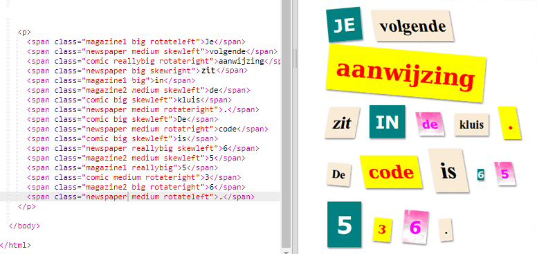
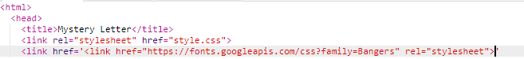

## Maak een nieuwe klasse

Laten we een stijl maken die eruitziet alsof deze uit een strip is gesneden. <a href="http://jumpto.cc/web-fonts" target="_blank">jumpto.cc/web-fonts</a> biedt een groot aantal lettertypen die gratis te gebruiken zijn.

+ Voeg een `strip` klasse toe in het **style.css** bestand. Na `magazine2` is een goede plek. Vergeet niet de punt voor de naam van de klasse. 

Maak je geen zorgen als je een waarschuwing krijgt dat 'Rule is empty' (De regel is leeg); je zult het zo meteen oplossen.

+ Voeg nu wat CSS toe aan de strip CSS-klasse. Je kunt verschillende kleuren gebruiken als je wilt. Er is een lijst met veel kleuren op <a href="http://jumpto.cc/colours" target="_blank">jumpto.cc/colours</a>.

+ Gebruik de strip stijl in een paar van de `` tags in je HTML-document en test je pagina:

+ Nu kun je een leuk lettertype toevoegen. Open een nieuw browser tabblad of -venster. Ga naar <a href="http://jumpto.cc/web-fonts" target="_blank">jumpto.cc/web-fonts</a> en zoek naar **'bangers'**:

+ Click on the font preview box then click on '+ Select this style':

View your selected fonts by clicking on the 'View your selected families' icon in the top right menu bar:

+ Go to the 'Use on the web' section, copy the text from the <link />
    box:

+ Plak de `<link>` code die je zojuist hebt gekopieerd van Google Fonts naar `<head>` van je webpagina:

Zo kun je het lettertype Bangers op je webpagina gebruiken.

+ Return to Google fonts and scroll further down to copy the CSS font-family code:

+ Ga nu terug naar je **'style.css'** bestand in je trinket en plak de font-family code in de strip stijl:

+ Test je webpagina. Het resultaat zou er ongeveer zo uit moeten zien: 

