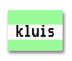

\--- challenge \---

## Uitdaging: maak een printeruitdraai stijl

Creëer een ouderwetse printeropmaak en pas het toe op enkele van de woorden:

Je hebt nodig:

+ De `VT323` -lettertype familie van <a href="http://jumpto.cc/web-fonts" target="_blank">jumpto.cc/web-fonts</a>. Ga terug naar stap 5 als niet meer weet hoe je Google-lettertypen kunt toepassen.

+ De `computer-printout-paper.png` achtergrondafbeelding. Ga naar stap 4 voor een terugblik op het gebruik van achtergrondafbeeldingen.

\--- /challenge \---