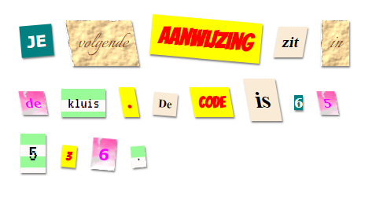

\--- challenge \---

## Uitdaging: maak je eigen stijlen

Maak nu je eigen klasse stijlen en maak je geheimzinnige brief nog interessanter. Gebruik de CSS die je in eerdere projecten hebt geleerd en bekijk de voorbeelden in **style.css** voor ideeën.

Hier is een voorbeeld:

Je kunt de beschikbare afbeeldingen bekijken door in trinket op de afbeeldingspictogram te klikken. Probeer afbeeldingsachtergronden in te stellen met een van de volgende afbeeldingen:

+ `rough-paper.png`

+ `canvas.png`

Als je een trinket-account hebt, kun je je eigen afbeeldingen uploaden zoals je deed in het 'Vertel een verhaal'-project.

Zoek lettertypen die je leuk vindt op <a href="http://jumpto.cc/web-fonts" target="_blank">jumpto.cc/web-fonts</a> en kopieer hun `<link>` en CSS-code naar je trinket om ze te gebruiken.

\--- /challenge \---