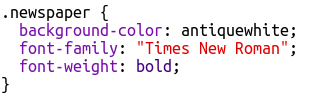

## Redigerer klasser

+ Klikk på **'style.css'** fanen. Finn stilen for `avisen` CSS-klassen du har brukt.

+ Legg merke til at det er en prikk (fullstopp) '.' før navnet på klassen i CSS-filen, men ikke i `` taggen i HTML-dokumentet ditt.

+ Se nå på de andre CSS-klassene som du pleide å style ditt mysterium brev. Kan du finne:
    
    + Hvordan `magasinet1` stilen endrer teksten til alle store bokstaver.
    
    + Hvordan `magazine2` stil setter et bilde bak teksten.

+ Hva skjer hvis du endrer `bakgrunnsbilde` for `magazine2` til `canvas.png`? Hvis du foretrekker `pink-pattern.png` kan du endre den tilbake. 

Du kan også endre fargene i magasinet stilene hvis du vil.

+ Finn CSS som brukes til å rotere og skjev (skrå) ordene dine:

Prøv å endre tallene for å opprette forskjellige effekter og deretter teste siden din.