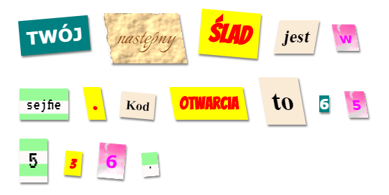

## Wprowadzenie

In this project, you'll create a mystery letter that looks like each word has been cut from a different newspaper, magazine, comic or other source.

### Dodatkowe informacje dla prowadzących klub

Jeśli chcesz wydrukować ten projekt, użyj [wersji do druku](https://projects.raspberrypi.org/en/projects/mystery-letter/print).

## \--- collapse \---

## title: Notatki dla liderów klubów

## Wprowadzenie:

In this project, children are introduced to CSS classes. They use multiple CSS classes to style text and also learn how to use background images and free Google fonts in their projects.

## Zasoby Online

Do pisania kodu HTML i CSS online rekomendujemy użytkowanie edytora [trinket](https://trinket.io/). Do tego projektu udostępnione są następujące szablony:

* ['Mystery Letter' starting point -- jumpto.cc/web-letter](http://jumpto.cc/web-letter)

Dzieci mogą też używać pustego edytora [(jumpto.cc/html-blank)](http://jumpto.cc/html-blank) do pisania swojego kodu HTML i CSS lub skorzystać z tego szablonu [(jumpto.cc/html-template)](http://jumpto.cc/html-template).

Dostępny jest także projekt zawierający przykładowe rozwiązania wyzwań:

* ['Mystery Letter Finished' -- trinket.io/html/1d4d4c5ce1](https://trinket.io/html/1d4d4c5ce1)

## Zasoby Offline

Ten projekt można także [wykonać offline](https://www.codeclubprojects.org/en-GB/resources/webdev-working-offline/). Materiały potrzebne do wykonania projektu dostępne są po kliknięciu linku "Materiały do projektu". Można znaleźć tam sekcję "Zasoby", która zawiera zasoby potrzebne dzieciom do wykonania projektu w trybie offline. Upewnij się, że każde dziecko ma dostęp do tych zasobów. Ta sekcja zawiera następujące pliki:

* mystery-letter/index.html
* mystery-letter/style.css
* mystery-letter/script.js
* mystery-letter/prefixfree.js
* mystery-letter/4 x .png images
* template/template.html
* template/style.css

Ukończoną wersję zadań z tego projektu można również znaleźć w sekcji "Zasoby dla wolontariuszy", która zawiera:

* mystery-letter-finished/index.html
* mystery-letter-finished/style.css
* mystery-letter-finished/script.js
* mystery-letter-finished/prefixfree.js
* mystery-letter-finished/4 x .png images

(Wszystkie powyższe zasoby można również pobrać jako pliki `.zip`.)

## Cele dydaktyczne

* This project introduces CSS classes and the ability to style HTML elements with multiple classes.
* Background images and Google fonts are also introduced. 

Projekt ten obejmuje elementy z następujących wątków [Cyfrowego programu nauczania Raspberry Pi](http://rpf.io/curriculum):

* [ Projektuj podstawowe zasoby 2D i 3D](https://www.raspberrypi.org/curriculum/design/creator).

## Zadania

* “Style your message” - Apply provided CSS class styles;
* “Create a computer printout style” - Use CSS to recreate an example class using a background image and Google font. 
* “Create your own styles” - Use CSS to create new styles.

\--- /collapse \---

## \--- collapse \---

## title: Materiały do projektu

## Zasoby projektu

* [Plik .zip zawierający wszystkie zasoby potrzebne do wykonania projektu](resources/letter-project-resources.zip)
* [Online Trinket containing all 'Mystery Letter' project resources](http://jumpto.cc/web-letter)
* [Pusty szablon Trinket](http://jumpto.cc/trinket-template)
* [Pusty Trinket](http://jumpto.cc/trinket-blank)
* [template/index.html](resources/template-index.html)
* [template/style.css](resources/template-style.css)
* [mystery-letter/index.html](resources/mystery-letter-index.html)
* [mystery-letter/style.css](resources/mystery-letter-style.css)
* [mystery-letter/prefixfree.js](resources/mystery-letter-prefixfree.js)
* [mystery-letter/rough-paper.png](resources/mystery-letter-rough-paper.png)
* [mystery-letter/canvas.png](resources/mystery-letter-canvas.png)
* [mystery-letter/pink-pattern.png](resources/mystery-letter-pink-pattern.png)
* [mystery-letter/computer-printout-paper.png](resources/mystery-letter-computer-printout-paper.png)

## Zasoby dla lidera klubu

* [Plik .zip zawierający zasoby z ukończonym projektem](resources/letter-volunteer-resources.zip)
* [Trinket zawierający ukończony projekt](https://trinket.io/html/1d4d4c5ce1)
* [mystery-letter-finished/index.html](resources/mystery-letter-finished-index.html)
* [mystery-letter-finished/style.css](resources/mystery-letter-finished-style.css)
* [mystery-letter-finished/prefixfree.js](resources/mystery-letter-finished-prefixfree.js)
* [mystery-letter-finished/rough-paper.png](resources/mystery-letter-finished-rough-paper.png)
* [mystery-letter-finished/canvas.png](resources/mystery-letter-finished-canvas.png)
* [mystery-letter-finished/pink-pattern.png](resources/mystery-letter-finished-pink-pattern.png)
* [mystery-letter-finished/computer-printout-paper.png](resources/mystery-letter-finished-computer-printout-paper.png)

\--- /collapse \---