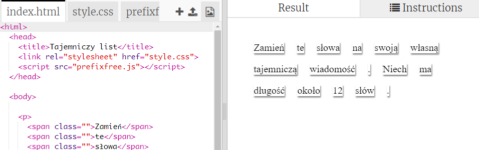
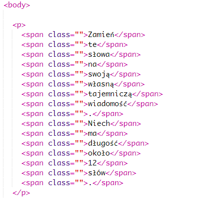
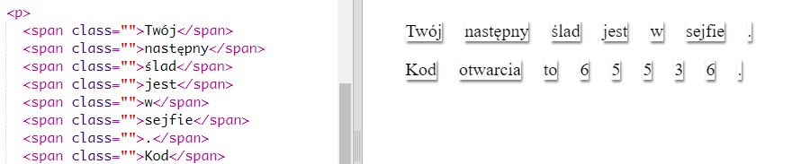

## Edytowanie Twojej wiadomości

Umieśćmy wiadomość na stronie web.

+ Otwórz edytor: <a href="https://trinket.io/html/0ea62e6c84" target="_blank">trinket.io/html/0ea62e6c84</a>.
    
    Projekt powinien wyglądać następująco:
    
    

+ Tag paragrafu `
` został wprowadzony w projekcie "Wszystkiego Najlepszego z okazji urodzin". Tag `` jest używany do grupowania małych fragmentów tekstu aby mogły być wyświetlane w określonym stylu.

+ Zamień te słowa na swoją wiadomość poprzez umieszczenie każdego słowa w oddzielnej sekcji ``. Jeśli Twoja wiadomość ma inną długość to dodaj tagi ``. 

+ Kliknij Run, aby przetestować swój kod.
    
    Jeśli popatrzysz na słowa, zobaczysz że zostały one wystylizowane tak, aby wyglądały jakby były przymocowane do strony.