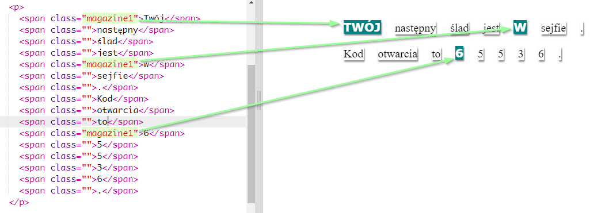

## Użycie stylów klas

+ Czy zauważyłeś wpis `class=""` w tagu ``? Możesz użyć go do stylizacji więcej niż jednego napisu w ten sam sposób.

+ Dodaj klasę `magazine1` do kilku Twoich tagów `` i przetestuj swoją stronę.

+ Możesz dodać więcej niż jedną klasę do elementu. Wystarczy jak pozostawisz między nimi odstęp. Dodaj klasę `big` do jednego z tagów ``. Przetestuj swoją stronę. 

