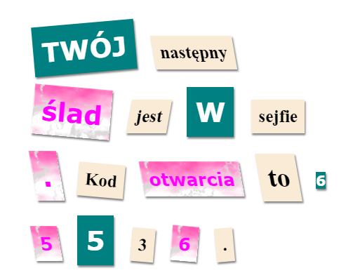

\--- wyzwanie \---

## Wyzwanie: Wystylizuj swoją wiadomość

Użyj udostępnionych stylów aby Twoja wiadomość wyglądała jak tajemniczy list.

Dodaj te klasy do swoich tagów ``:

+ `newspaper`, `magazine1`, `magazine2`

+ `medium`, `big`, `reallybig`

+ `rotateleft`, `rotateright`

+ `skewleft`, `skewright`

Nie dodawaj więcej niż jednej klasy z danej linii do danego ``.

Twój kod powinien wyglądać tak:

\--- /challenge \---