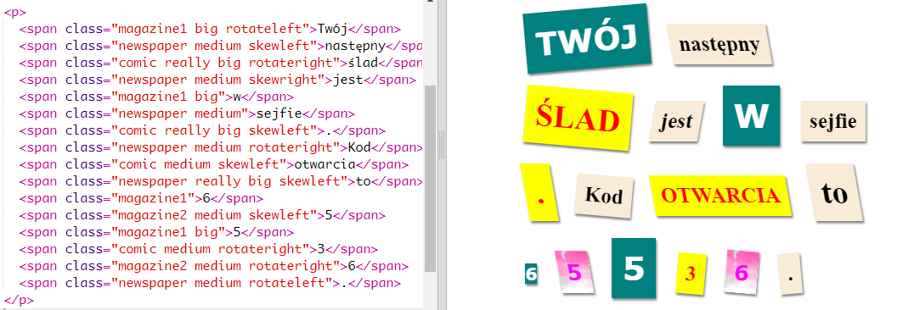
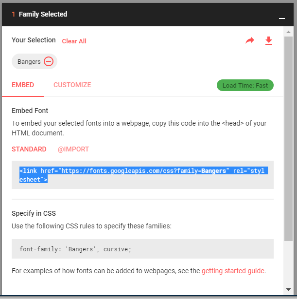
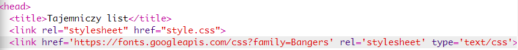
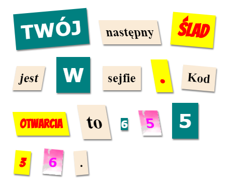

## Tworzenie nowej klasy

Stwórzmy styl, który wygląda jakby został wycięty z komiksu. <a href="http://jumpto.cc/web-fonts" target="_blank">jumpto.cc/web-fonts</a> dostarcza mnóstwo czcionek, z których można korzystać bezpłatnie.

+ Dodaj klasę `comic` w pliku **style.css**. Miejsce za `magazine2` będzie odpowiednie. Nie zapomnij o kropce przed nazwą klasy. 

Nie martw się, jeśli pojawi się ostrzeżenie 'The Rule is empty' (Reguła jest pusta); naprawisz to później.

+ Teraz dodaj jakiś styl CSS do komiksowej klasy CSS. Możesz użyć różnych kolorów jeśli chcesz. Mnóstwo kolorów znajdziesz w <a href="http://jumpto.cc/colours" target="_blank">jumpto.cc/colours</a>.

+ Użyj komiksowego stylu w niektórych tagach `` w swoim dokumencie HTML i przetestuj swoją stronę:

+ Teraz możesz dodać zabawną czcionkę. Otwórz nową kartę lub okno przeglądarki. Przejdź do strony <a href="http://jumpto.cc/web-fonts" target="_blank">jumpto.cc/web-fonts</a> i wyszukaj **"bangers”**:

+ Click on the font preview box then click on '+ Select this style':

View your selected fonts by clicking on the 'View your selected families' icon in the top right menu bar:

+ Go to the 'Use on the web' section, copy the text from the <link />
    box:

+ Wklej kod `<link>`, który właśnie skopiowałeś z czcionek Google, do sekcji `<head>` swojej strony:

Dzięki temu możesz używać czcionki Bangers na swojej stronie.

+ Return to Google fonts and scroll further down to copy the CSS font-family code:

+ Teraz wróć do pliku **„style.css”** w trinkecie i wklej kod font-family do stylu komiksowego (comic):

+ Przetestuj swoją stronę. Efekt powinien być taki jak poniżej: 

