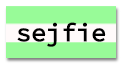

--- challenge ---

## Wyzwanie: Stwórz styl wydruku komputerowego

Utwórz staromodny styl wydruku komputerowego i zastosuj go do niektórych słów:

Będziesz potrzebować:

+ Rodzinę czcionek `VT323` z <a href="http://jumpto.cc/web-fonts" target="_blank">jumpto.cc/web-fonts</a>. Wróć do kroku 5, jeśli potrzebujesz przypomnienia jak używać czcionki Google.

+ Obraz tła `computer-printout-paper.png`. Wróć do kroku 4, jeśli potrzebujesz przypomnienia jak używać obrazy tła.

--- /challenge ---