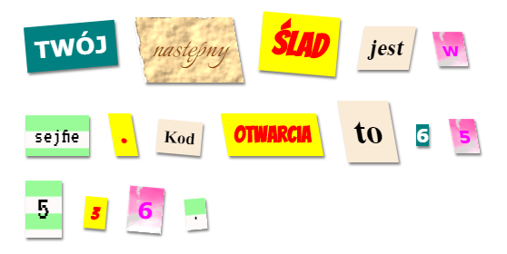

\--- wyzwanie \---

## Wyzwanie: Utwórz swoje własne style

Teraz stwórz swoje własne style klas i uczyń swój tajemniczy list jeszcze bardziej interesującym. Skorzystaj z CSS, którego nauczyłeś się w poprzednich projektach i zainspiruj się przykładami z **style.css**.

Oto przykład:

Możesz przejrzeć obrazy, z których możesz skorzystać, klikając zakładkę Images (Obrazy) w trinket. Spróbuj ustawić obraz tła za pomocą jednego z dołączonych obrazów:

+ `rough-paper.png`

+ `canvas.png`

Jeśli masz konto w trinket, możesz podesłać własne zdjęcia, tak jak to miało miejsce w projekcie „Opowiedz historię”.

Znajdź czcionki, które lubisz na <a href="http://jumpto.cc/web-fonts" target="_blank">jumpto.cc/web-fonts</a> i skopiuj ich `<link>` i kod CSS do swojego trinketa, aby z nich skorzystać.

\--- /challenge \---