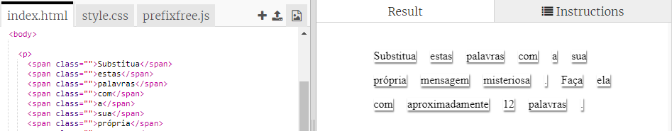
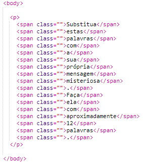
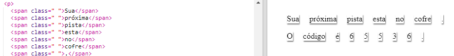

## Editando sua mensagem

Vamos colocar sua mensagem em uma página da web.

+ Abra este trinket: <a href="https://trinket.io/html/4b553eb364" target="_blank">jumpto.cc/web-letter</a>.
    
    O projeto deve ficar assim:
    
    

+ A tag de parágrafo `
` é apresentada no projeto "Carta Misteriosa". A tag `` é usada para agrupar pequenos pedaços de texto dentro de um parágrafo para que possamos estilizá-los.

+ Mude as palavras para a sua mensagem colocando uma palavra em cada tag ``. Você precisará adicionar ou remover a tag `` se a mensagem tiver um comprimento diferente. 

+ Clique no botão Run para testar seu trinket.
    
    Se você observar as palavras, verá que elas foram estilizadas para parecer que foram colocadas na página.