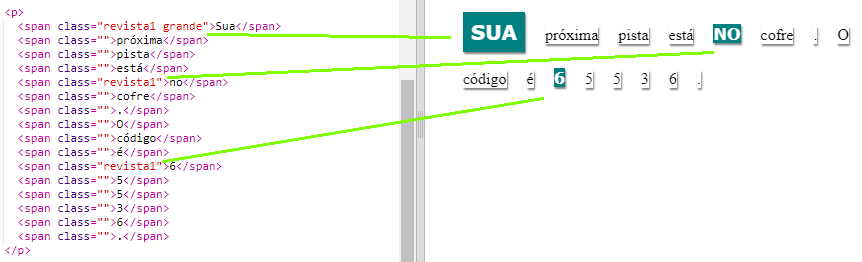
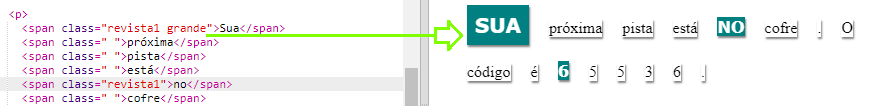

## Usando estilos de classe

+ Você notou a `class = ""` nas tags ``? Você pode usar isso para estilizar mais de uma coisa da mesma maneira.

+ Adicione a classe `magazine1` a algumas de suas tags `` e teste sua página na web.

+ Você pode adicionar mais de uma classe a um elemento. Apenas deixe um espaço no meio. Adicione a classe `big` a uma das suas tags ``. Teste sua página. 

