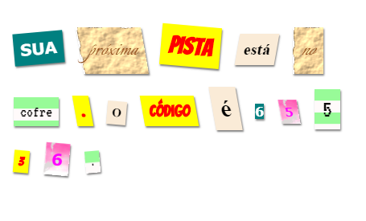

\--- challenge \---

## Desafio: Estilize sua mensagem

Use os estilos fornecidos para fazer com que sua mensagem pareça uma carta misteriosa.

Adicione esta classe às suas tags ``:

+ `newspaper`, `magazine1`, `magazine2`

+ `medium`, `big`, `reallybig`

+ `rotateleft`, `rotateright`

+ `skewleft`, `skewright`

Não adicione mais de um de cada linha a um determinado ``.

É assim que sua carta pode parecer:

\--- /challenge \---