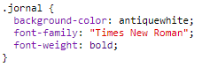
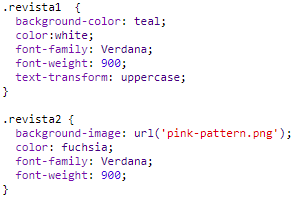
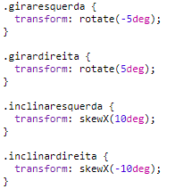

## Editando as Classes

+ Clique na guia **'style.css'**. Encontre o estilo para a classe CSS `newspaper` que você está usando.

+ Observe que há um ponto (ponto final) '.' antes do nome da classe no arquivo CSS, mas não na tag `` no seu documento HTML.

+ Agora olhe para as outras classes CSS que você usou para estilizar sua carta misteriosa. Você pode encontrar:
    
    + Como o estilo `magazine1` altera o texto para todas as letras maiúsculas (maiúsculas).
    
    + Como o estilo `magazine2` coloca uma imagem por trás do texto.

+ O que acontece se você mudar a `background-image` de `magazine2` para `canvas.png`? Se você preferir `pink-pattern.png` você pode mudá-lo de volta. 

Você também pode alterar as cores nos estilos de revista, se quiser.

+ Encontre o CSS usado para girar e inclinar (tilt) suas palavras:

Tente alterar os números para criar efeitos diferentes e depois testar sua página.