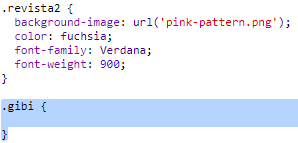
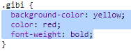
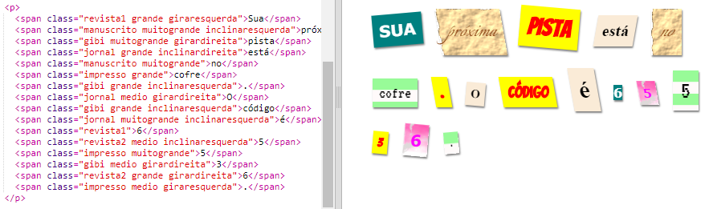
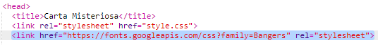
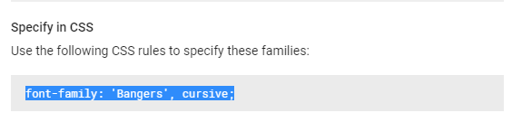
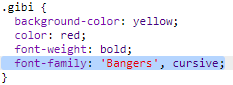
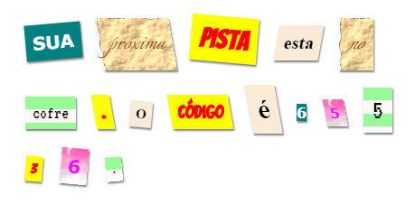

## Criando uma nova classe

Vamos criar um estilo que parece ter sido cortado de um Comic. <a href="http://jumpto.cc/web-fonts" target="_blank">jumpto.cc/web-fonts</a> fornece fontes para estilizar os textos que são livres para usar.

+ Adicione uma classe `comic` no arquivo **style.css**. Depois de `magazine2` é um ótimo lugar. Lembre-se do ponto na frente do nome da classe. 

Não se preocupe se você receber um aviso dizendo que 'The Rule is empty'; você vai consertar isso em seguida.

+ Agora adicione um pouco de CSS à classe CSS em quadrinhos. Você pode usar cores diferentes, se quiser. Há uma lista de cargas de cores em <a href="http://jumpto.cc/colours" target="_blank">jumpto.cc/colours</a>.

+ Use o estilo de quadrinhos em algumas das tags `` do seu documento HTML e teste sua página:

+ Agora você pode adicionar uma fonte divertida. Abra uma nova guia ou janela do navegador. Vá para <a href="http://jumpto.cc/web-fonts" target="_blank">jumpto.cc/web-fonts</a> e procure por **'Bangers'**:

+ Click on the font preview box then click on '+ Select this style':

View your selected fonts by clicking on the 'View your selected families' icon in the top right menu bar:

+ Go to the 'Use on the web' section, copy the text from the <link />
    box:

+ Cole o `<link>` copiado do Google Fonts na `<head>` da sua página da Web:

This allows you to use the Bangers font in your webpage.

+ Return to Google fonts and scroll further down to copy the CSS font-family code:

+ Agora volte para o seu arquivo **'style.css'** no trinket e cole o código da família da fonte dentro do estilo comic:

+ Teste sua página web. O resultado deve ser algo como isto: 

