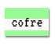

\--- challenge \---

## Desafio: Criar um estilo de impressão de computador

Crie um estilo de impressão de computador antigo e aplique-o a algumas das palavras:

Você vai precisar:

+ A família de fontes `VT323` do <a href="http://jumpto.cc/web-fonts" target="_blank">jumpto.cc/web-fonts </a>. Volte ao passo 5 se precisar de um lembrete sobre o uso de fontes do Google.

+ A imagem de fundo `computer-printout-paper.png`. Olhe para o Passo 4 se precisar de um lembrete sobre o uso de imagens de fundo.

\--- /challenge \---