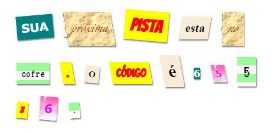

--- challenge ---

## Desafio: Criando seu próprio estilo

Agora crie seus próprios estilos de classe e torne sua carta misteriosa ainda mais interessante. Use o CSS que você aprendeu em projetos anteriores e veja os exemplos em **style.css** para novas ideias.

Aqui está um lindo exemplo:

Você pode ver as imagens que estão disponíveis para uso clicando na guia Imagens no trinket. Tente definir fundos de imagem usando uma das imagens incluídas:

+ `rough-paper.png`

+ `canvas.png`

Se você tem uma conta de trinket, você pode fazer upload de suas próprias imagens, como você fez no projeto 'Conte uma estoria'.

Encontre fontes que você gosta em <a href="http://jumpto.cc/web-fonts" target="_blank">jumpto.cc/web-fonts</a> e copie seus `<link>` e código CSS em seu trinket para usá-los.

--- /challenge ---