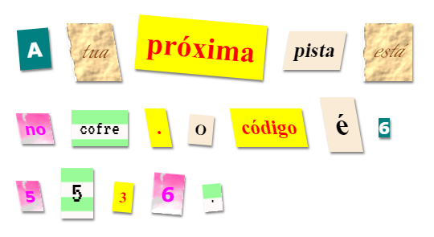

## Introdução

Neste projecto, vais criar uma carta mistério, que parece que cada palavra foi recortada de vários jornais, revistas, banda desenhada, ou de outras fontes.

### Informação adicional para os lideres dos clubes

Se precisar imprimir este projeto, por favor, use a [versão para impressão](https://projects.raspberrypi.org/en/projects/mystery-letter/print).

## \--- collapse \---

## title: Notas para os líderes de clube

## Introdução:

Neste projecto, as crianças são apresentadas às Classes CSS. Elas usam múltiplas Classes CSS para estilizar o texto e, também, aprender a usar imagens de fundo e fontes livres da Google.

## Recursos Online

Recomendamos utilizar o [trinket](https://trinket.io/) para escrever HTML & CSS online. Esta projeto contém o seguinte trinket:

* [Início da "Carta Mistério -- jumpto.cc/web-letter](http://jumpto.cc/web-letter)

As crianças podem também usar este trinket em branco [(jumpto.cc/html-blank)](http://jumpto.cc/html-blank) para escrever o seu próprio HTML & CSS, ou alternativamente podem usar este trinket de modelo [(jumpto.cc/html-template)](http://jumpto.cc/html-template).

Há também um trinket que contém uma amostra de solução para os desafios:

* ["Carta Mistério" Concluída -- trinket.io/html/1d4d4c5ce1](https://trinket.io/html/1d4d4c5ce1)

## Recursos Offline

Este projeto pode ser [concluído offline](https://www.codeclubprojects.org/en-GB/resources/webdev-working-offline/) se preferires. Pode aceder aos recursos do projeto clicando no link "Materiais do Projeto" deste projeto. Este link contém uma secção "Recursos do projeto", que inclui recursos que as crianças precisam para concluir este projeto offline. Certifiqua-te de que cada criança tem acesso a uma cópia destes recursos. Esta secção inclui os seguintes arquivos:

* mystery-letter/index.html
* mystery-letter/style.css
* mystery-letter/script.js
* mystery-letter/prefixfree.js
* mystery-letter/4 x .png images
* template/template.html
* template/style.css

Também podes encontrar uma versão completa dos desafios deste projeto na secção 'Recursos para Voluntários', que contém:

* mystery-letter-finished/index.html
* mystery-letter-finished/style.css
* mystery-letter-finished/script.js
* mystery-letter-finished/prefixfree.js
* mystery-letter-finished/4 x .png images

(Todos os recursos acima também são transferíveis como arquivos `.zip` do projeto ou voluntários.)

## Objectivos de Aprendizagem

* Este projeto apresenta as classes CSS e a capacidade de estilizar elementos HTML com múltiplas classes.
* Imagens de fundo e fontes Google também são apresentadas. 

Este projeto abrange elementos das seguintes vertentes do [ Currículo Raspberry Pi para a Produção Digital ](http://rpf.io/curriculum):

* [Criar conteúdos básicos em 2D e 3D](https://www.raspberrypi.org/curriculum/design/creator).

## Desafios

* "Estiliza sua mensagem" - Aplicar estilos de classe CSS fornecidos;
* "Cria um estilo de impressão do computador" - use CSS para recriar uma classe de exemplo usando uma imagem de fundo e uma fonte do Google. 
* "Criar o teu próprio estilo" - Usa CSS para criar novos estilos.

\--- /collapse \---

## \--- collapse \---

## title: Materiais do Projeto

## Recursos do Projeto

* [arquivo .zip contendo todos os recursos do projeto](resources/letter-project-resources.zip)
* [Trinket on-line contendo todos os recursos do projeto "Carta Mistério"](http://jumpto.cc/web-letter)
* [Trinket modelo on-line](http://jumpto.cc/trinket-template)
* [Trinket em branco on-line](http://jumpto.cc/trinket-blank)
* [template/index.html](resources/template-index.html)
* [template/style.css](resources/template-style.css)
* [mystery-letter/index.html](resources/mystery-letter-index.html)
* [mystery-letter/style.css](resources/mystery-letter-style.css)
* [mystery-letter/prefixfree.js](resources/mystery-letter-prefixfree.js)
* [mystery-letter/rough-paper.png](resources/mystery-letter-rough-paper.png)
* [mystery-letter/canvas.png](resources/mystery-letter-canvas.png)
* [mystery-letter/pink-pattern.png](resources/mystery-letter-pink-pattern.png)
* [mystery-letter/computer-printout-paper.png](resources/mystery-letter-computer-printout-paper.png)

## Recursos para o Líder do Clube

* [Arquivo .zip contendo todos os recursos do projeto concluídos](resources/letter-volunteer-resources.zip)
* [Projeto Trinket concluido on-line](https://trinket.io/html/1d4d4c5ce1)
* [mystery-letter-finished/index.html](resources/mystery-letter-finished-index.html)
* [mystery-letter-finished/style.css](resources/mystery-letter-finished-style.css)
* [mystery-letter-finished/prefixfree.js](resources/mystery-letter-finished-prefixfree.js)
* [mystery-letter-finished/rough-paper.png](resources/mystery-letter-finished-rough-paper.png)
* [mystery-letter-finished/canvas.png](resources/mystery-letter-finished-canvas.png)
* [mystery-letter-finished/pink-pattern.png](resources/mystery-letter-finished-pink-pattern.png)
* [mystery-letter-finished/computer-printout-paper.png](resources/mystery-letter-finished-computer-printout-paper.png)

\--- /collapse \---