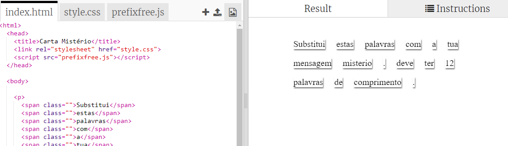
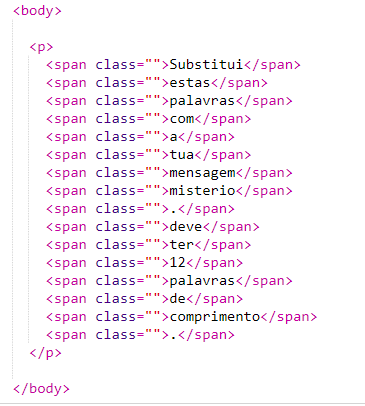
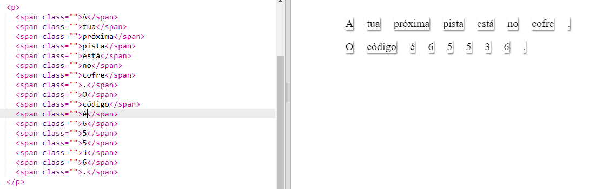

## Edita a Tua Mensagem

Vamos colocar sua mensagem em uma página da web.

+ Abre este trinket: <a href="http://jumpto.cc/web-letter" target="_blank">jumpto.cc/web-letter</a>.
    
    O projeto deverá ser parecido com este:
    
    

+ A tag de parágrafo `
` é introduzida no projeto "Feliz Aniversário". A tag `` é usada para agrupar partes menores de texto dentro de um parágrafo, para que possamos estilizá-las.

+ Muda as palavras para a tua mensagem colocando uma palavra em cada ``. Vais precisar adicionar ou remover tags `` se a tua mensagem tiver um tamanho diferente. 

+ Clica no botão Run para testar o teu trinket.
    
    Se prestares atenção às palavras, poderás ver que elas foram estilizadas para parecer que foram coladas na página.