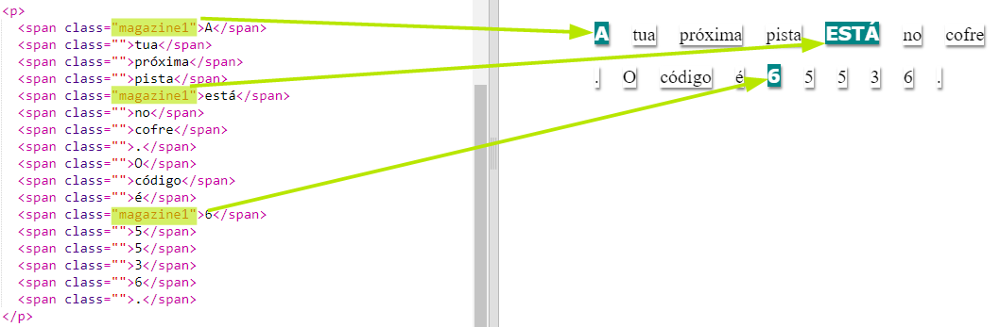
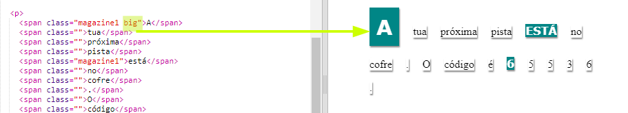

## Usando Estilos de Classes

+ Notas-te o `class=""` nas tags ``? Podes usar este estilo para estilizar mais do que uma coisa da mesma forma.

+ Adiciona a classe `magazine1` em algumas dos teus ``.

+ Podes adicionar mais do que uma classe num elemento. Basta por um espaço entre elas. Adiciona a classes `big` a uma das tags ``. Testa a tua página. 

