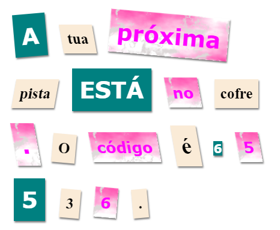

\--- challenge \---

## Desafio: Estiliza a Tua Mensagem

Usa os estilos fornecidos para fazer com que a tua mensagem se pareça com uma carta mistério.

Adiciona estas classes às tuas tags ``:

+ `newspaper`, `magazine1`, `magazine2`

+ `medium`, `big`, `reallybig`

+ `rotateleft`, `rotateright`

+ `skewleft`, `skewright`

Não adiciones num mesmo `` mais do um da mesma linha.

A tua carta pode ficar com este aspecto:

\--- /challenge \---