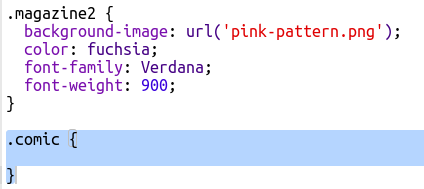
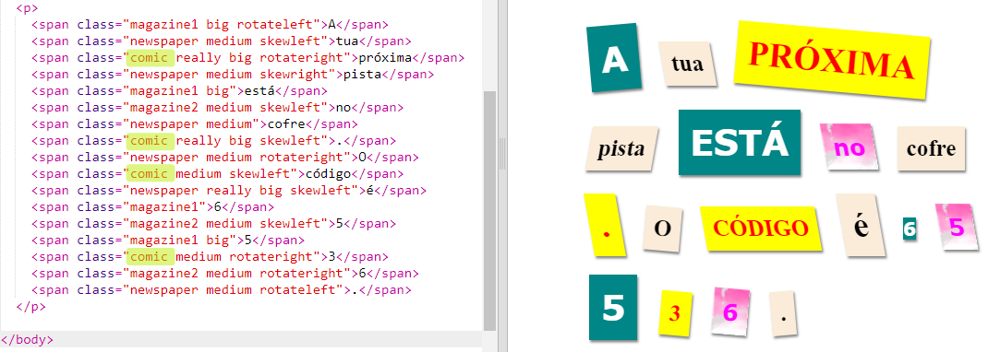
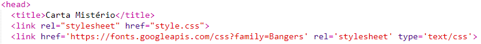
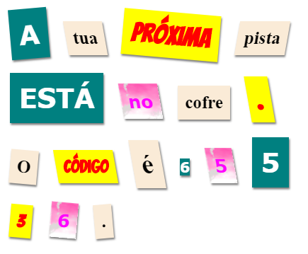

## Cria uma Nova Classe

Vamos criar um estilo que parece que foi recortado de uma Banda Desenhada. <a href="http://jumpto.cc/web-fonts" target="_blank">jumpto.cc/web-fonts</a> fornece muitas fontes que são de uso livre.

+ Adiciona a classe `comic` no arquivo **style.css**. Um bom lugar é depois de `magazine2`. Não te esqueças do ponto antes do nome da classe. 

Não te preocupes se receberes um aviso a dizer 'The Rule is empty' (A Regra está vazia), vais corrigir isso já a seguir.

+ Agora acrescenta algum CSS na Classe CSS Comic. Podes usar cores diferentes se quiseres. Tens uma lista com muitas cores em <a href="http://jumpto.cc/colours" target="_blank">jumpto.cc/colours</a>.

+ Usa o estilo comic em alguns dos tags `` do teu documento HTML e testa a tua página:

+ Agora podes acrescentar uma fonte engraçada. Abre um novo separador ou uma nova janela do teu navegador. Vai em <a href="http://jumpto.cc/web-fonts" target="_blank">jumpto.cc/web-fonts</a> e pesquisa por **'bangers'**:

+ Click on the font preview box then click on '+ Select this style':

View your selected fonts by clicking on the 'View your selected families' icon in the top right menu bar:

+ Go to the 'Use on the web' section, copy the text from the <link />
    box:

+ Cola o codigo `<link>`, que acabaste de copiar do Google Fonts, no tag `<head>` da tua página web:

Isto te permite usar a fonte Bangers na tua página web.

+ Return to Google fonts and scroll further down to copy the CSS font-family code:

+ Agora vai no teu arquivo **'style.css'** no trinket e cola o código da font-family no estilo comic:

+ Testa a tua página web. O resultado tem que ser parecido como isto: 

