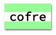

\--- challenge \---

## Desafio: Cria um Estilo de impressão de computador

Cria um estilo de impressão de computador de antigamente e aplica-o a algumas das palavras:

Vais precisar:

+ A família de fonte `VT323` que podes encontrar em <a href="http://jumpto.cc/web-fonts" target="_blank">jumpto.cc/web-fonts</a>. Volta ao Passo 5 se precisares de te lembrar como usar o Google Fonts.

+ A imagem de fundo `computer-printout-paper.png`. Volta ao Passo 4 se precisares de te lembrar como usar imagens de fundo.

\--- /challenge \---