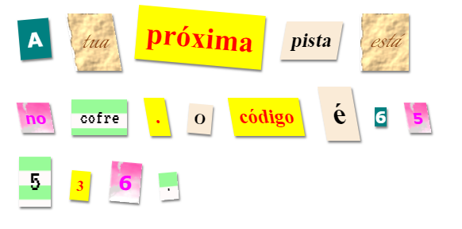

\--- challenge \---

## Desafio: Cria os Teus Próprios Estilos

Agora cria os teus próprios estilos de classes e torna a tua carta mistério ainda mais interessante. Usa o CSS que tens apreendido nos projectos anteriores e olha para os exemplos no **style.css** para teres ideias.

Aqui tens um exemplo:

Podes ver as imagens que estão disponíveis, clicando no separador Images no trinket. Tenta definir imagens de fundo usando uma das imagens incluídas:

+ `rough-paper.png`

+ `canvas.png`

Se tens uma conta no trinket podes carregar imagens tuas como fizeste no Projecto "Conta uma História".

Encontra fontes que gostes em <a href="http://jumpto.cc/web-fonts" target="_blank">jumpto.cc/web-fonts</a> e copia o código CSS do `<link>` para o teu trinket e usa-as.

\--- /challenge \---