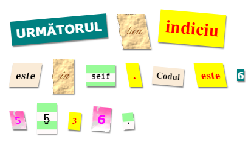

## Introducere

În acest proiect, vei crea o scrisoare misterioasă care arată ca și cum fiecare cuvânt a fost tăiat din diferite ziare, reviste, cărți de benzi desenate sau alte părți.

### Informații suplimentare pentru conducătorii de club

Dacă vrei să printezi acest proiect, folosește [Versiunea printabilă](https://projects.raspberrypi.org/en/projects/mystery-letter/print).

## \--- collapse \---

## title: Note pentru conducătorul clubului

## Introducere:

În acest proiect, copiii sunt introduși în clasele CSS. Ei folosesc mai multe clase CSS pentru a stiliza text și pentru a învăța cum să folosească imagini de fundal și fonturi gratuite Google în proiectele lor.

## Resurse online

Recomandăm utilizarea [trinket](https://trinket.io/) pentru a scrie HTML & CSS online. Acest proiect conține următorul trinket:

* [Punctul de început pentru „Scrisoare misterioasă” -- jumpto.cc/web-letter](http://jumpto.cc/web-letter)

Copiii pot, de asemenea, să folosească acest trinket gol [(jumpto.cc/html-blank)](http://jumpto.cc/html-blank) pentru a scrie propriul cod HTML & CSS sau, alternativ, acest șablon trinket [(jumpto.cc/html-template)](http://jumpto.cc/html-template).

Există, de asemenea, un trinket care conține un exemplu de soluție pentru provocări:

* [„Scrisoare misterioasă” finalizat -- trinket.io/html/1d4d4c5ce1](https://trinket.io/html/1d4d4c5ce1)

## Resurse offline

Acest proiect poate fi [completat offline](https://www.codeclubprojects.org/en-GB/resources/webdev-working-offline/) dacă dorești. Poți accesa resursele proiectului dând click pe link-ul „Materiale pentru proiect”. Acest link conține o secțiune „Resursele proiectului” ce include materialele de care copiii vor avea nevoie pentru realizarea proiectului offline. Asigură-te că fiecare copil are acces la câte o copie din aceste resurse. Secțiunea include următoarele fișiere:

* mystery-letter/index.html
* mystery-letter/style.css
* mystery-letter/script.js
* mystery-letter/prefixfree.js
* mystery-letter/4 x imagini .png
* template/template.html
* template/style.css

De asemenea, poți găsi o versiune completă a provocărilor din acest proiect în secțiunea „Resursele voluntarilor”, care conține:

* mystery-letter-finished/index.html
* mystery-letter-finished/style.css
* mystery-letter-finished/script.js
* mystery-letter-finished/prefixfree.js
* mystery-letter-finished/4 x imagini .png

(Toate resursele de mai sus se pot descărca ca și fișiere `.zip` pentru proiecte și voluntari.)

## Obiective de învățare

* Acest proiect introduce clasele CSS și abilitatea de a stiliza elementele HTML cu clase multiple.
* Sunt prezentate și imaginile de fundal și fonturile Google. 

Acest proiect acoperă elemente din următoarele domenii ale curriculumului [Raspberry Pi Digital Making](http://rpf.io/curriculum):

* [Proiectarea elementelor grafice 2D și 3D de bază](https://www.raspberrypi.org/curriculum/design/creator).

## Provocări

* „Stilizează-ți mesajul” - Aplică stilurile claselor CSS puse la dispoziție;
* „Creează un șablon de printare” - Folosește CSS pentru a recrea o clasă de exemplu folosind o imagine de fundal și un font Google. 
* „Creează-ți propriile stiluri” - Folosește CSS pentru a crea noi stiluri.

\--- /collapse \---

## \--- collapse \---

## title: Materiale pentru proiect

## Resursele proiectului

* [fișier .zip care conține toate resursele proiectului](resources/letter-project-resources.zip)
* [Trinket online care conține toate resursele proiectului „Scrisoare misterioasă”](http://jumpto.cc/web-letter)
* [Șablon Trinket online](http://jumpto.cc/trinket-template)
* [Trinket online gol](http://jumpto.cc/trinket-blank)
* [template/index.html](resources/template-index.html)
* [template/style.css](resources/template-style.css)
* [mystery-letter/index.html](resources/mystery-letter-index.html)
* [mystery-letter/style.css](resources/mystery-letter-style.css)
* [mystery-letter/prefixfree.js](resources/mystery-letter-prefixfree.js)
* [mystery-letter/rough-paper.png](resources/mystery-letter-rough-paper.png)
* [mystery-letter/canvas.png](resources/mystery-letter-canvas.png)
* [mystery-letter/pink-pattern.png](resources/mystery-letter-pink-pattern.png)
* [mystery-letter/computer-printout-paper.png](resources/mystery-letter-computer-printout-paper.png)

## Resurse pentru conducătorul clubului

* [fișier .zip care conține toate resursele proiectului, completate](resources/letter-volunteer-resources.zip)
* [Proiect Trinket online, completat](https://trinket.io/html/1d4d4c5ce1)
* [mystery-letter-finished/index.html](resources/mystery-letter-finished-index.html)
* [mystery-letter-finished/style.css](resources/mystery-letter-finished-style.css)
* [mystery-letter-finished/prefixfree.js](resources/mystery-letter-finished-prefixfree.js)
* [mystery-letter-finished/rough-paper.png](resources/mystery-letter-finished-rough-paper.png)
* [mystery-letter-finished/canvas.png](resources/mystery-letter-finished-canvas.png)
* [mystery-letter-finished/pink-pattern.png](resources/mystery-letter-finished-pink-pattern.png)
* [mystery-letter-finished/computer-printout-paper.png](resources/mystery-letter-finished-computer-printout-paper.png)

\--- /collapse \---