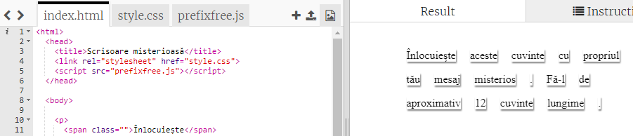
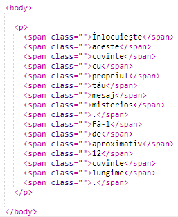
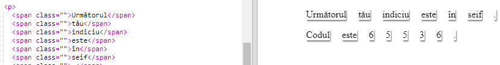

## Editarea mesajului tău

Hai să pune mesajul tău într-o pagină web.

+ Deschide acest trinket. <a href="http://jumpto.cc/web-letter" target="_blank">jumpto.cc/web-letter</a>.
    
    Proiectul ar trebui să arate astfel:
    
    

+ Eticheta paragrafului `
` este introdusă în proiectul „La mulți ani”. Eticheta `` este folosită pentru a grupa părți mai mici de text în interiorul unui paragraf pentru a le putea stiliza.

+ Schimbă cuvintele din mesajul tău punând fiecare cuvânt într-un ``. Va trebui să adaugi sau să ștergi etichetele `` dacă mesajul tău are o lungime diferită. 

+ Dă click pe butonul Run pentru a testa trinket-ul tău.
    
    Dacă te uiți la cuvinte, poți vedea că ele au fost stilizate ca și cum ele au lipite de pagină.