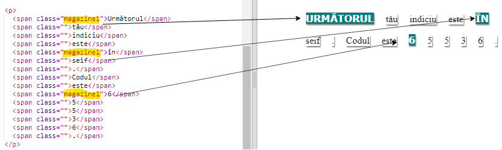
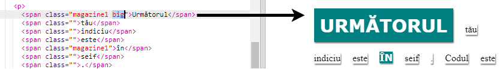

## Folosirea claselor de stiluri

+ Ai observat `class=""` în etichetele ``? Poți să folosești asta pentru a stiliza mai mult de un lucru în același fel.

+ Adaugă clasa `magazine1` la câteva dintre etichetele `` și testează-ți pagina.

+ Poți adăuga mai mult de o clasă la un element. Doar lasă un spațiu între clase. Adaugi clasa `big` la una dintre etichetele tale ``. Testează-ți pagina. 

