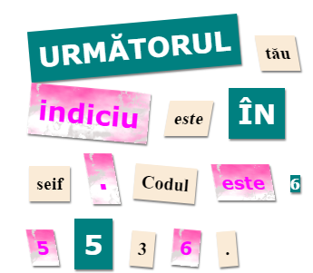

\--- challenge \---

## Provocare: stilizează-ți mesajul

Folosește stilurile puse la dispoziție pentru a face mesajul tău să arate ca și o scrisoare misterioasă.

Adaugă aceste clase la etichetele tale ``:

+ `newspaper`, `magazine1`, `magazine2`

+ `medium`, `big`, `reallybig`

+ `rotateleft`, `rotateright`

+ `skewleft`, `skewright`

Nu adăuga mai mult de o clasă de pe o anumită linie într-un singur ``.

Așa ar putea să arate scrisoarea ta:

\--- /challenge \---