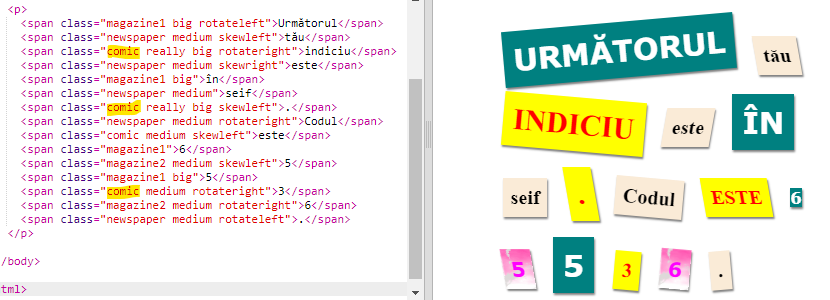
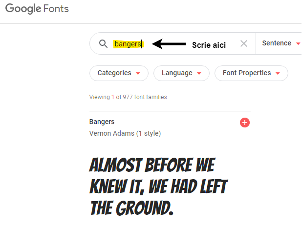
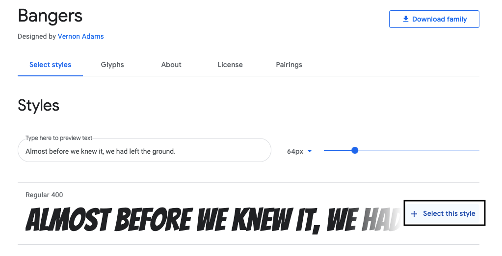
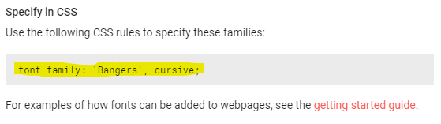
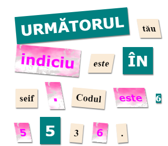

## Crearea unei noi clase

Hai să creăm un stil care arată ca și cum a fost decupat dintr-o carte de benzi desenate. <a href="http://jumpto.cc/web-fonts" target="_blank">jumpto.cc/web-fonts</a> oferă o mulțime de fonturi care pot fi folosite gratuit.

+ Adaug o clasă `comic` în fișierul **style.css**. După `magazine2` e un loc potrivit. Nu uita punctul din fața numelui clasei. 

Nu-ți face griji dacă primești o eroare care spune „The Rule is empty”; o vei remedia imediat.

+ Acum, adaugă câteva proprietăți CSS la clasa CSS comic. Poți folosi diferite culori dacă dorești. Poți găsi o listă cu o mulțime de culori pe <a href="http://jumpto.cc/colours" target="_blank">jumpto.cc/colours</a>.

+ Folosește stilul comic într-o etichetă `` din documentul tău HTML și testează-ți pagina:

+ Acum, poți adăuga un font amuzant. Deschide o nouă filă sau fereastră în browser-ul tău. Mergi la <a href="http://jumpto.cc/web-fonts" target="_blank">jumpto.cc/web-fonts</a> și caută **„bangers”**:

+ Dă click pe butonul + „Select this font”:

Un mesaj care spune „1 Family Selected” va apărea în partea de jos a ecranului.

+ Dă click pe mesajul ”1 Family Selected” pentru a deschide fereastra și apoi copiază codul evidențiat:

+ Lipește codul `<link>` pe care l-ai copiat din fonturile Google în interiorul etichetei `<head>` din pagina ta web:

Acesta îți permite să folosești fontul Bangers în pagina ta web.

+ Întoarce-te la Google Fonts și derulează în jos pentru a copia codul font-family:

+ Acum, mergi înapoi la fișierul tău **„style.css”** din trinket și lipește codul font-family în stilul comic:

+ Testează-ți pagina web. Rezultatul ar trebui să arate așa: 

