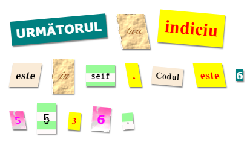

\--- challenge \---

## Provocare: creează-ți propriile stiluri

Acum, creează-ți propriile clase de stiluri și fă-ți scrisoarea misterioasă și mai interesantă. Folosește codul CSS pe care l-ai învățat în proiectele anterioare și uită-te în exemplele din **style.css** pentru idei.

Iată un exemplu:

Poți vedea că imaginile care sunt disponibile pentru utilizare dânt click pe tab-ul Images din trinket. Încearcă să setezi imagini de fundal folosing una dintre imaginile incluse:

+ `rough-paper.png`

+ `canvas.png`

Dacă au un cont trinket, poți încărca singur imaginile dorite ca și în proiectul „Spune o poveste”.

Găsește fonturi care îți plac pe <a href="http://jumpto.cc/web-fonts" target="_blank">jumpto.cc/web-fonts</a> și copiază codul `<link>` și CSS-ul în trinket-ul tău pentru a le folosi.

\--- /challenge \---