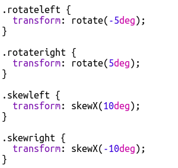

## Уређивање класа

+ Кликните на ** 'style.css'** картицу. Пронађите стил за `newspaper` ЦСС класу коју сте користили.

+ Примјетите да постоји тачка '.' пре назива класе у ЦСС датотеци, али не и ознака `` у вашем ХТМЛ документу.

+ Сада погледајте остале ЦСС класе које сте користили за стилизовање свог мистериозног писма. Можете ли пронаћи:
    
    + Како `magazine1` стил мења текст у сва велика слова.
    
    + Како `magazine2` стил поставља слику иза текста.

+ Шта се догађа ако промените `background-image` за ` magazine2` у `canvas.png` ? Ако више волите `pink-pattern.png` можете да га вратите назад. 

Такође можете променити боје у стиловима магазина ако желите.

+ Пронађите ЦСС који се користи за ротирање и нагибање (нагињање) ваших речи:

Покушајте да промените бројеве да бисте створили различите ефекте, а затим тестирајте своју страницу.