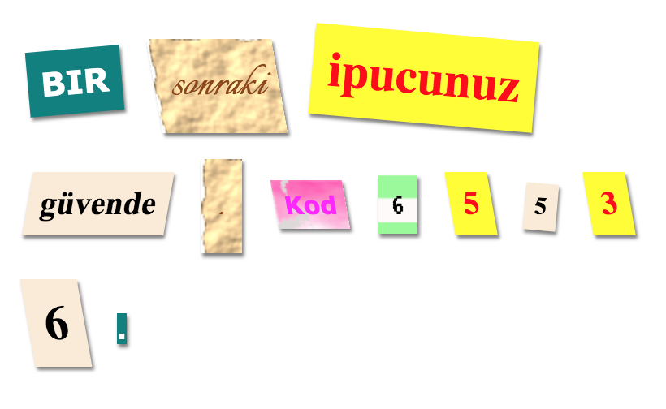

## Giriş

Bu projede, her kelimenin farklı bir gazeteden, dergiden, çizgi romandan veya başka bir kaynaktan kesilmiş gibi görünen gizemli bir mektup oluşturacaksınız.

### Kulüp liderleri için ek bilgi

Bu projeyi yazdırmanız gerekiyorsa, lütfen [Yazıcı dostu sürüm](https://projects.raspberrypi.org/en/projects/mystery-letter/print).

## \--- çöküş \---

## başlık: Kulüp lideri notları

## Giriş:

Bu projede çocuklar CSS sınıflarına tanıtılıyor. Metne stil vermek için birden fazla CSS sınıfı kullanıyorlar ve ayrıca projelerinde arka plan resimleri ve ücretsiz Google fontlarını nasıl kullanacaklarını öğreniyorlar.

## Çevrimiçi kaynaklar

Çevrimiçi HTML & CSS yazmak için [biblo](https://trinket.io/) kullanmanızı öneririz. Bu proje aşağıdaki biblo içeriyor:

* ['Mystery Letter' başlangıç noktası - jumpto.cc/web-letter](http://jumpto.cc/web-letter)

Çocuklar da bu boş biblo yararlanabilirler [(jumpto.cc/html-blank)](http://jumpto.cc/html-blank) kendi HTML yazmak için & CSS ya da alternatif olarak bu şablon biblo kullanabilirsiniz [(jumpto.cc/html-template)](http://jumpto.cc/html-template).

Ayrıca zorluklara örnek bir çözüm içeren bir biblo da var:

* ['Gizemli Mektup Tamamlandı' - trinket.io/html/1d4d4c5ce1](https://trinket.io/html/1d4d4c5ce1)

## Çevrimdışı Kaynaklar

Bu proje, istenirse [çevrimdışı](https://www.codeclubprojects.org/en-GB/resources/webdev-working-offline/) tamamlanabilir. Proje kaynaklarına, bu proje için 'Proje Malzemeleri' bağlantısını tıklayarak erişebilirsiniz. Bu link, çocukların bu projeyi çevrimdışı tamamlamaları için ihtiyaç duyacağı kaynakları içeren bir 'Proje Kaynakları' bölümü içermektedir. Her çocuğun bu kaynakların bir kopyasına erişimi olduğundan emin olun. Bu bölüm aşağıdaki dosyaları içerir:

* gizem harfli / index.html
* gizem harfli / style.css
* gizem harfli / script.js
* gizem harfli / prefixfree.js
* gizem mektubu / 4 x .png görüntüleri
* Şablon / template.html
* Şablon / style.css

Bu projenin zorluklarının tamamlanmış bir versiyonunu da içeren 'Gönüllü Kaynaklar' bölümünde bulabilirsiniz:

* gizem harfli mamul / index.html
* gizem harfli mamul / style.css
* gizem harfli mamul / script.js
* gizem harfli mamul / prefixfree.js
* gizem-harf-bitmiş / 4 x .png görüntüleri

(Yukarıdaki kaynakların tümü proje olarak da indirilebilir ve gönüllü `.zip` dosyadır)

## Öğrenme hedefleri

* Bu proje, CSS sınıflarını ve HTML öğelerini birden fazla sınıfla biçimlendirme yeteneğini sunar.
* Arka plan resimleri ve Google fontları da tanıtıldı. 

Bu proje, [Raspberry Pi Dijital Hazırlama Müfredatı](http://rpf.io/curriculum)aşağıdaki bölümlerinden elemanları içermektedir:

* [Temel 2B ve 3B varlıkların tasarlanması](https://www.raspberrypi.org/curriculum/design/creator).

## Zorluklar

* “Mesajınızı stillendirin” - Verilen CSS sınıfı stillerini uygulayın;
* “Bilgisayar çıktısı stili oluşturma” - Bir arka plan resmi ve Google fontu kullanarak örnek bir sınıfı yeniden oluşturmak için CSS'yi kullanın. 
* “Kendi stillerini oluştur” - Yeni stiller oluşturmak için CSS kullanın.

\--- /çöküş \---

## \--- çöküş \---

## başlık: Proje malzemeleri

## Proje kaynakları

* [tüm proje kaynaklarını içeren .zip dosyası](resources/letter-project-resources.zip)
* [Tüm 'Mystery Letter' proje kaynaklarını içeren çevrimiçi Biblo](http://jumpto.cc/web-letter)
* [Çevrimiçi Biblo şablonu](http://jumpto.cc/trinket-template)
* [Çevrimiçi boş biblo](http://jumpto.cc/trinket-blank)
* [Şablon / index.html](resources/template-index.html)
* [Şablon / style.css](resources/template-style.css)
* [gizem harfli / index.html](resources/mystery-letter-index.html)
* [gizem harfli / style.css](resources/mystery-letter-style.css)
* [gizem harfli / prefixfree.js](resources/mystery-letter-prefixfree.js)
* [gizem harfli / kaba paper.png](resources/mystery-letter-rough-paper.png)
* [gizem harfli / canvas.png](resources/mystery-letter-canvas.png)
* [gizem harfli / pembe-pattern.png](resources/mystery-letter-pink-pattern.png)
* [gizem harfli / bilgisayar çıktısı-paper.png](resources/mystery-letter-computer-printout-paper.png)

## Kulüp lideri kaynakları

* [tamamlanan tüm proje kaynaklarını içeren .zip dosyası](resources/letter-volunteer-resources.zip)
* [Online biblo projesi tamamlandı](https://trinket.io/html/1d4d4c5ce1)
* [gizem harfli mamul / index.html](resources/mystery-letter-finished-index.html)
* [gizem harfli mamul / style.css](resources/mystery-letter-finished-style.css)
* [gizem harfli mamul / prefixfree.js](resources/mystery-letter-finished-prefixfree.js)
* [gizem harfli mamul / kaba paper.png](resources/mystery-letter-finished-rough-paper.png)
* [gizem harfli mamul / canvas.png](resources/mystery-letter-finished-canvas.png)
* [gizem harfli mamul / pembe-pattern.png](resources/mystery-letter-finished-pink-pattern.png)
* [gizem harfli mamul / bilgisayar çıktısı-paper.png](resources/mystery-letter-finished-computer-printout-paper.png)

\--- /çöküş \---