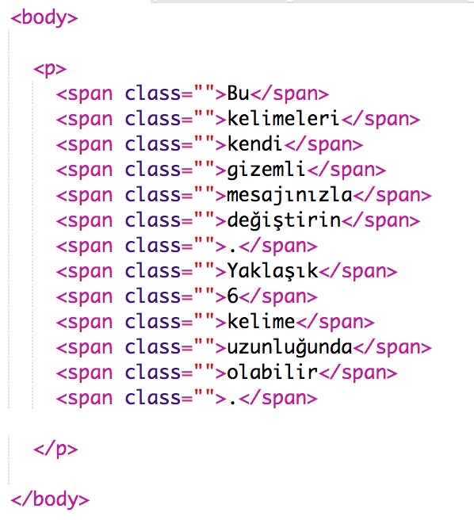
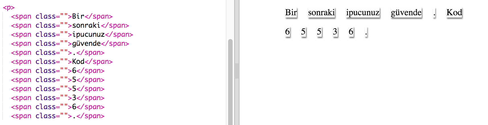

## Mesajınızı Düzenleyin

Mesajınızı bir web sayfasında açalım.

+ Şu trinketi aç: <a href="http://jumpto.cc/web-letter" target="_blank">jumpto.cc/web-letter</a>.
    
    Proje şöyle görünmeli:
    
    

+ `
` paragraf etiketi 'Doğum Günün Kutlu Olsun' projesinde tanıtılmıştı. `` etiketi, bir paragraf içindeki daha küçük metin parçalarını gruplamak için kullanılır, böylece onları şekillendirebiliriz.

+ Her bir `` içine birer kelime koyarak mesajınızdaki kelimeleri değiştirin. Mesajınız farklı bir uzunluktaysa `` etiketi eklemeniz veya kaldırmanız gerekir. 

+ Trinketinizi test etmek için Çalıştır düğmesine tıklayın.
    
    Kelimelere bakarsanız, sayfaya yapışmış gibi görünmek için stil verildiklerini görebilirsiniz.