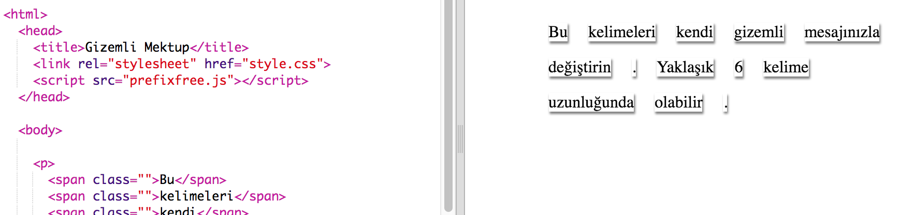

## Mesajınızı Düzenlemek

Mesajınızı bir web sayfasına iletelim.

+ Bu bibloyu aç: <a href="http://jumpto.cc/web-letter" target="_blank">jumpto.cc/web-letter</a>.
    
    Proje şöyle görünmeli:
    
    

+ `
` paragraf etiketi 'Doğum Günün Kutlu Olsun' projesinde tanıtıldı. `` etiketi, bir paragraf içindeki daha küçük metin parçalarını gruplamak için kullanılır, böylece onları şekillendirebiliriz.

+ Her bir ``birer kelime koyarak mesajınızdaki kelimeleri değiştirin. Mesajınız farklı bir uzunluktaysa `` etiketi eklemeniz veya kaldırmanız gerekir. 

+ Ivır zıvırınızı test etmek için Çalıştır düğmesine tıklayın.
    
    Kelimelere bakarsanız, sayfaya yapışmış gibi görünmek için stil verildiklerini görebilirsiniz.