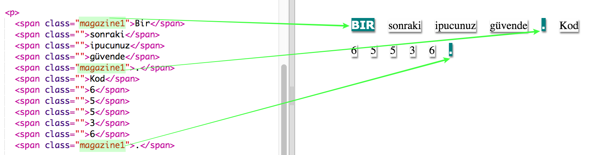

## Sınıf Stillerini Kullanma

+ `` etiketinde `sınıfını = ""` gördünüz mü? Aynı şekilde birden fazla şeyi stillendirmek için bunu kullanabilirsiniz.

+ `` etiketlerinizden birkaçına `magazine1` sınıfını ekleyin ve web sayfanızı test edin.

+ Bir elemana birden fazla sınıf ekleyebilirsiniz. Sadece aralarında bir boşluk bırakın. `big` sınıfını `` etiketinizden birine ekleyin. Sayfanızı test edin. 

