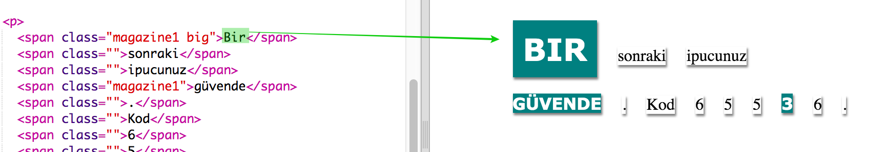

## Sınıf Stillerini Kullanma

+ `` etiketleri içinde `class=""` kısmını fark ettiniz mi? Bunu birden fazla şeyi aynı şekilde stillendirmek için kullanabilirsiniz.

+ `dergi1` sınıfını birkaç tane `` etiketine ekleyin ve web sayfanızı test edin.

+ Bir elemana birden fazla sınıf ekleyebilirsiniz. Sadece aralarında bir boşluk bırakın. `buyuk` sınıfını `` etiketinizden birine ekleyin. Sayfanızı test edin. 

