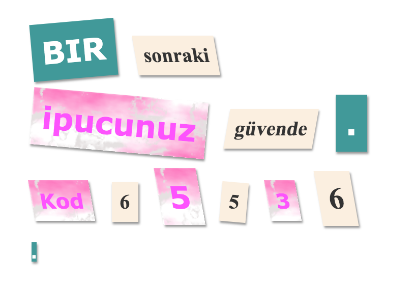

\--- challenge \---

## Meydan Okuma: Mesajını Stillendir

Mesajınızın gizemli bir mektup gibi görünmesini sağlamak için verilen stilleri kullanın.

Bu sınıfları `` etiketlerinize ekleyin:

+ `gazete`, `dergi1`, `dergi2`

+ `orta`, `buyuk`, `cokbuyuk`

+ `soladondur`, `sagadondur`

+ `solaeg`, `sagaeg`

Bir `` içine her satırdaki sınıflardan sadece bir tanesini ekle.

Mektubunuz şöyle gözükmeli:

\--- /challenge \---