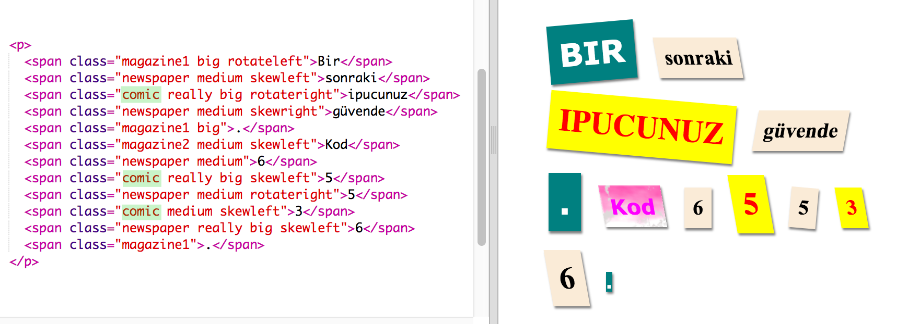
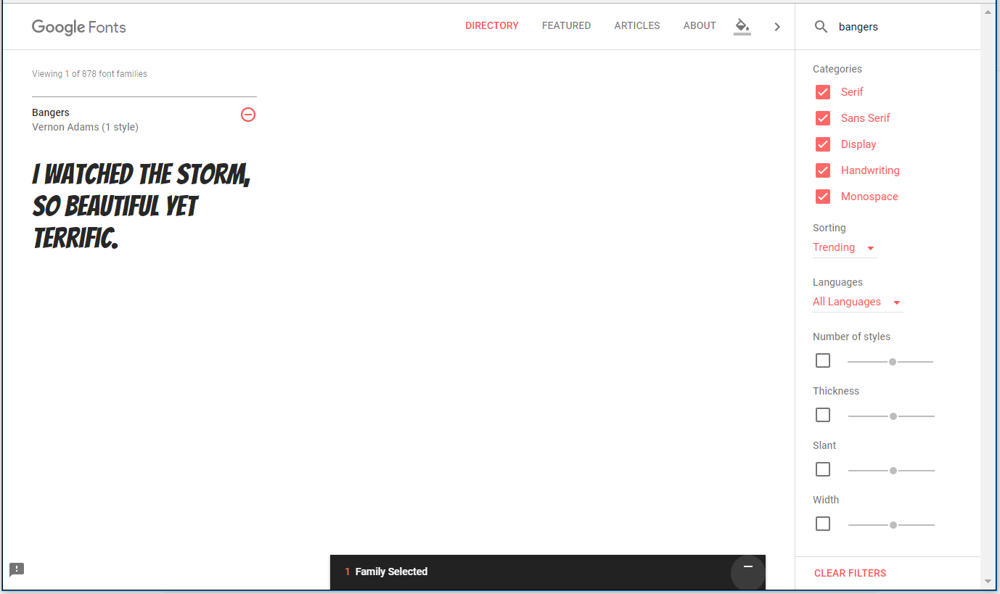
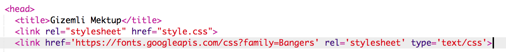
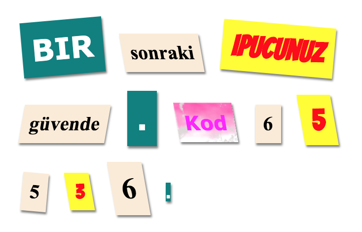

## Yeni Bir Sınıf Oluştur

Bir Comic'ten kesilmiş gibi görünen bir stil yaratalım. <a href="http://jumpto.cc/web-fonts" target="_blank">jumpto.cc/web-fonts</a> , kullanımı ücretsiz yazı tiplerini sağlar.

+ **style.css** dosyasına `komik` sınıfı ekleyin. `sonra magazine2` iyi bir yer. Sınıf adının önündeki noktayı unutma. 

'Kural boş' diyen bir uyarı alırsanız endişelenmeyin; daha sonra düzelteceksin.

+ Şimdi komik CSS sınıfına bir miktar CSS ekleyin. İsterseniz farklı renkler kullanabilirsiniz. <a href="http://jumpto.cc/colours" target="_blank">jumpto.cc/colours</a>adresinde birçok renk listesi vardır.

+ Çizgi roman stilini, HTML belgenizdeki `` etiketlerinden bazılarında kullanın ve sayfanızı test edin:

+ Şimdi eğlenceli bir yazı tipi ekleyebilirsiniz. Yeni bir tarayıcı sekmesi veya penceresi açın. <a href="http://jumpto.cc/web-fonts" target="_blank">jumpto.cc/web-fonts</a> ve **'bangers'**arayın:

+ + "Bu yazı tipini seç" düğmesini tıklayın:

Ekranın alt kısmında "Aile Seçildi" mesajı belirecektir.

+ Pencereyi açmak ve vurgulanan kodu kopyalamak için "Aile Seçileni Seç" mesajını tıklayın:

+ Yapıştır `<link>` sadece içine Google yazı kopyaladığınız kodu `<head>` web sayfanızın:

Bu, web sayfanızdaki Bangers yazı tipini kullanmanızı sağlar.

+ Google fontlarına dönün ve sayfayı aşağı kaydırın ve font ailesi kodunu kopyalayın:

+ Şimdi biblodaki **'style.css'** dosyasına geri dönün ve font-family kodunu çizgi roman stiline yapıştırın:

+ Web sayfanızı test edin. Sonuç şöyle görünmeli: 

