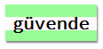

\--- meydan okuma \---

## Zorluk: Bir Bilgisayar Çıktı Stili Oluştur

Eski moda bir bilgisayar çıktısı stili oluşturun ve bazı sözcüklere uygulayın:

İhtiyacın olacak:

+ <a href="http://jumpto.cc/web-fonts" target="_blank">jumpto.cc/web-fonts</a>`VT323` font ailesi. Google fontlarını kullanmayla ilgili bir hatırlatıcıya ihtiyacınız varsa 5. Adıma bakın.

+ `bilgisayar çıktısı-paper.png` arka plan resmi. Arka plan resimlerini kullanmak için bir hatırlatma gerekiyorsa 4. Adım'a tekrar bakın.

\--- /meydan okuma \---