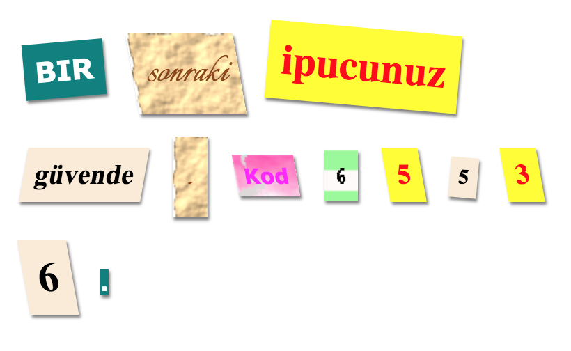

\--- meydan okuma \---

## Zorluk: Kendi Stillerini Yarat

Şimdi kendi sınıf stillerini yarat ve gizemli mektubunu daha da ilginçleştir. Daha önceki projelerde öğrendiğiniz CSS'yi kullanın ve fikirleri için **style.css** örneklere bakın.

İşte bir örnek:

Kullanılabilir görüntüleri bibloda Görüntüler sekmesine tıklayarak görebilirsiniz. Ekteki görüntülerden birini kullanarak görüntü arka planını ayarlamayı deneyin:

+ `kaba paper.png`

+ `canvas.png`

Eğer bir biblo hesabınız varsa, 'Bir Hikaye Anlat' Projesinde olduğu gibi kendi resimlerinizi yükleyebilirsiniz.

<a href="http://jumpto.cc/web-fonts" target="_blank">atlamak istediğiniz yazı tiplerini bulun jumpto.cc/web-fonts</a> ve `<link>` ve CSS kodlarını kullanmak için bibloya kopyalayın.

\--- /meydan okuma \---