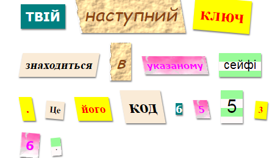

## Ознайомлення

В цьому проекті ви створите містичний лист,у якому кожне слово буде вирізане з різних газет, журналів, коміксів та інших джерел.

### Додаткова інформація для лідерів клубу

Якщо вам потрібно надрукувати цей проект, будь ласка, використовуйте [Printer friendly version](https://projects.raspberrypi.org/en/projects/mystery-letter/print).

## \---collapse\---

## title: лідер клубу зауважує

## Вступ:

В цьому проекті дідти ознайомляться з видами CSS. Вони використовуюють багатофункціональні категорії CSS, щоб стилізувати текст і також навчитися як користуватися фоновими зображеннями та вільними шрифтами Google у своїх проектах.

## Онлайн Ресурси

Ми рекомендуємо використовувати [trinket](https://trinket.io/) щоб написати HTML & CSS онлайн. Цей проект містить наступний trinket:

* ['Загадковий Лист' початок -- jumpto.cc/web-letter](http://jumpto.cc/web-letter)

Діти також можуть використовувати цей пустий trinket [jumpto.cc/html-blank)](http://jumpto.cc/html-blank), щоб написати їхній власний HTML & CSS, або вони можуть використовувати цей шаблон trinket [(jumpto.cc/html-template)](http://jumpto.cc/html-template).

Є також trinket, що містить зразки вирішення \---challenges\---:

* ['Загадковий Лист пройдено' -- trinket.io/html/1d4d4c5ce1](https://trinket.io/html/1d4d4c5ce1)

## Офлайн Ресурси

Цей проект може бути [завершений офлайн](https://www.codeclubprojects.org/en-GB/resources/webdev-working-offline/), якщо потрібно. Ви можете отримати доступ до ресурсів проекту, натиснувши посилання " Матеріали Проекту" для цього проекту. Це посилання містить розділ "Ресурси Проекту", який включає в себе ресурси, що будуть потрібні дітям, аби завершити проект офлайн. Переконайтеся, що кожна дитина має доступ до копій цих ресурсів. Ця секція містить наступні файли:

* mystery-letter/index.html
* mystery-letter/style.css
* mystery-letter/script.js
* mystery-letter/prefixfree.js
* mystery-letter/4 x .png images
* template/template.html
* template/style.css

Також, ви можете знайти завершену версію \---challenges\--- цього проекту в секції "Волонтерські Ресурси", яка містить:

* mystery-letter-finished/index.html
* mystery-letter-finished/style.css
* mystery-letter-finished/script.js
* mystery-letter-finished/prefixfree.js
* mystery-letter-finished/4 x .png images

(All of the resources above are also downloadable as project and volunteer `.zip` files.)

## Learning Objectives

* This project introduces CSS classes and the ability to style HTML elements with multiple classes.
* Background images and Google fonts are also introduced. 

This project covers elements from the following strands of the [Raspberry Pi Digital Making Curriculum](http://rpf.io/curriculum):

* [Design basic 2D and 3D assets](https://www.raspberrypi.org/curriculum/design/creator).

## Challenges

* “Style your message” - Apply provided CSS class styles;
* “Create a computer printout style” - Use CSS to recreate an example class using a background image and Google font. 
* “Create your own styles” - Use CSS to create new styles.

\--- /collapse \---

## \--- collapse \---

## title: Project materials

## Project resources

* [.zip file containing all project resources](resources/letter-project-resources.zip)
* [Online Trinket containing all 'Mystery Letter' project resources](http://jumpto.cc/web-letter)
* [Online Trinket template](http://jumpto.cc/trinket-template)
* [Online blank Trinket](http://jumpto.cc/trinket-blank)
* [template/index.html](resources/template-index.html)
* [template/style.css](resources/template-style.css)
* [mystery-letter/index.html](resources/mystery-letter-index.html)
* [mystery-letter/style.css](resources/mystery-letter-style.css)
* [mystery-letter/prefixfree.js](resources/mystery-letter-prefixfree.js)
* [mystery-letter/rough-paper.png](resources/mystery-letter-rough-paper.png)
* [mystery-letter/canvas.png](resources/mystery-letter-canvas.png)
* [mystery-letter/pink-pattern.png](resources/mystery-letter-pink-pattern.png)
* [mystery-letter/computer-printout-paper.png](resources/mystery-letter-computer-printout-paper.png)

## Club leader resources

* [.zip file containing all completed project resources](resources/letter-volunteer-resources.zip)
* [Online completed Trinket project](https://trinket.io/html/1d4d4c5ce1)
* [mystery-letter-finished/index.html](resources/mystery-letter-finished-index.html)
* [mystery-letter-finished/style.css](resources/mystery-letter-finished-style.css)
* [mystery-letter-finished/prefixfree.js](resources/mystery-letter-finished-prefixfree.js)
* [mystery-letter-finished/rough-paper.png](resources/mystery-letter-finished-rough-paper.png)
* [mystery-letter-finished/canvas.png](resources/mystery-letter-finished-canvas.png)
* [mystery-letter-finished/pink-pattern.png](resources/mystery-letter-finished-pink-pattern.png)
* [mystery-letter-finished/computer-printout-paper.png](resources/mystery-letter-finished-computer-printout-paper.png)

\--- /collapse \---