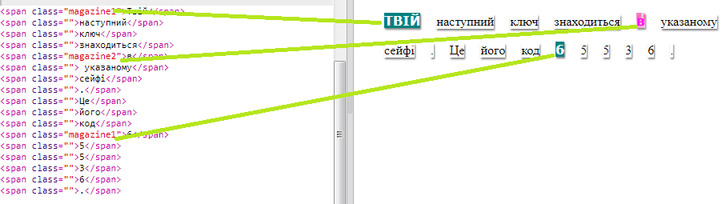

## Використання Стилів Класу

+ Чи звернули ви увагу на `class=""` in the `` коди? Ви можете використовувати їх, щоб стилізувати більше, аніж один елемент одночасно.

+ Add the `magazine1` class to a few of your `` tags and test your webpage.

+ You can add more than one class to an element. Just leave a space in between. Add the `big` class to one of your `` tags. Test your page. 

