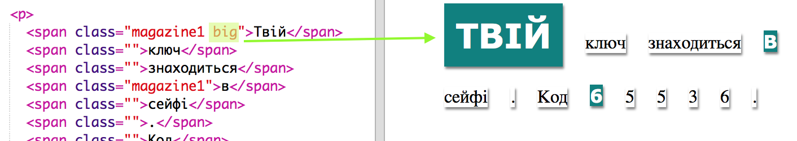

## Використання Стилів Класу

+ Чи звернули ви увагу на `class=""` in the `` коди? Ви можете використовувати їх, щоб стилізувати більше, аніж один елемент одночасно.

+ Додайте клас `magazine1` до кількох `` тегів і протестуйте вашу вебсторінку.

+ Можна додати більше, аніж 1 клас в елемент. Залишіть простір. Додайте `великий` клас до одного з ``тегів. Протестуйте вашу сторінку. 

