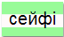

\--- challenge \---

## Редагування Класів

\--- task \---

Ви також можете змінювати кольори стилів журналу, якщо забажаєте.

Спробуйте змінити числа, щоб створити різні ефекти і тоді протестуйте свою сторінку.

\--- /task \---

\--- task \---

Create another new class with your own style, and apply it to some of the words in your message. We have included two other image backgrounds for you to use if you want to:

+ `rough-paper.png`
+ `canvas.png`

\--- /task \---

\--- /challenge \---