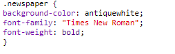

## Редагування Класів

+ Натисніть на знак **'style.css'**. Знайдіть стиль для CSS класу `газети`, який ви використовували.

+ Зауважте, що перед назвою класу в CSS файліє крапка '.', але не в `` тегу у вашому HTML документі.

+ А зараз подивіться на інші класи CSS які ви використовували для стилізації вашоно містичного листа. Ви можете знайти:
    
    + Зараз стиль `журнал1` змінить літери у тексті на великі.
    
    + Як стиль`журнал2` поміщає зображення за текст.

+ Що трапляється, коли ви змінюєте `фонове-зображення` для `журнал2` на `canvas.png`? Якщо ви надаєте перевагу `pink-pattern.png`, ви можете змінити її назад. 

Ви також можете змінювати кольори стилів журналу, якщо забажаєте.

+ Знайдіть CSS, що використовується для оберту ті нахилення ваших слів:

Спробуйте змінити числа, щоб створити різні ефекти і тоді протестуйте свою сторінку.