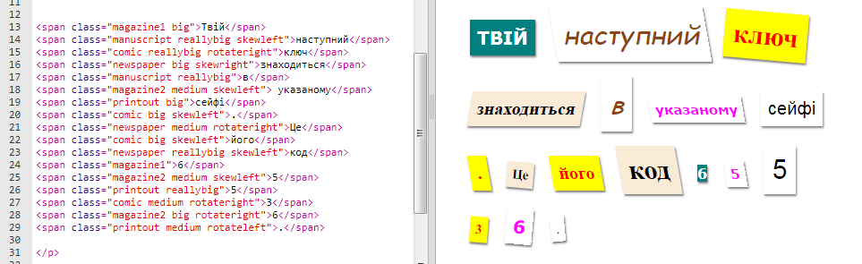
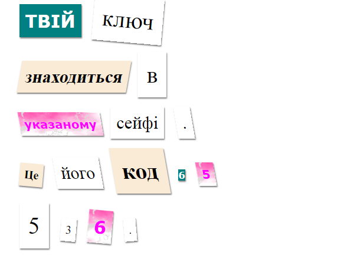

## Створи новий клас

Давайте створимо стиль, що матиме вигляд, вирізаного з Коміксу. <a href="http://jumpto.cc/web-fonts" target="_blank">jumpto.cc/web-fonts</a>тут є види шрифтів, які можна використовувати.

+ Додайте `comic`клас у файл **style.css** . Після `magazine2`є хороше місце. Не забудьте крапку перед назвою класу. 

Не хвилюйтеся, якщо ви побачили попередження " Правило пусте "; ви виправите це згодом.

+ Зараз додайте трохи CSS до комічного стилю CSS. Можете використовувати кольори, які забажаєте. Панель кольорів тут <a href="http://jumpto.cc/colours" target="_blank">jumpto.cc/colours</a>.

+ Використайте комічний стиль у деяких ``тегах вашого документу HTML і протестуйте свою сторінку:

+ Тепер можете додати веселий шрифт. Відкрийте нове вікно браузера. Перейдіть до<a href="http://jumpto.cc/web-fonts" target="_blank">jumpto.cc/web-fonts</a> і шукайте **'bangers'**:

+ Click on the font preview box then click on '+ Select this style':

View your selected fonts by clicking on the 'View your selected families' icon in the top right menu bar:

+ Go to the 'Use on the web' section, copy the text from the <link />
    box:

+ Вставте `<link>` код, який ви скопіювали з Goole шрифтів у `<head>` вашо веб-сторінки:

This allows you to use the Bangers font in your webpage.

+ Return to Google fonts and scroll further down to copy the CSS font-family code:

+ Тепер поверніться до вашого файлу **'style.css'** в trinket і вставте код гарнітури шрифтів у комічний стиль:

+ Протестуйте сторінку. Результат повинен виглядати так: 

