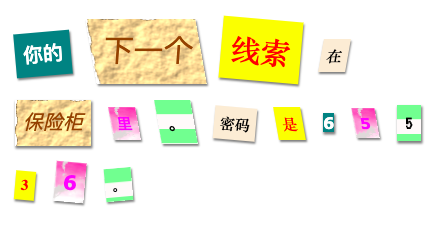

## 介绍

在这个项目中，你将创建一封神秘信件，看起来每个单词都是从不同的报纸、杂志、漫画或其他地方剪下来的。

### 俱乐部导师的附加信息

如果您需要打印此项目，请使用[适合打印版本](https://projects.raspberrypi.org/zh-CN/projects/mystery-letter/print) 。

--- collapse ---
---
title: 俱乐部导师说明
---

## 介绍：

在这个项目中，介绍了CSS的类。 他们将学习使用多个CSS类来设计文本的样式，并学习如何在项目中使用背景图像和免费的谷歌字体。

## 在线资源

我们推荐使用[trinket](https://trinket.io/) 来在线完成 HTML & CSS 的代码。 这个项目包括以下 trinket：

* [“神秘信件” 的开始部分 -- trinket.io/html/7810eca943](https://trinket.io/html/7810eca943)

孩子们也可以用这个空白 trinket [(jumpto.cc/html-blank)](http://jumpto.cc/html-blank) 来编写自己的 HTML & CSS，或者他们可以用这个 trinket 模板 [(jumpto.cc/html-template)](http://jumpto.cc/html-template)。

以下的trinket代码包含编写挑战的示范解决方案：

* [“完成的神秘信件” -- trinket.io/html/04f30572dd](https://trinket.io/html/04f30572dd)

## 离线资源

如有需要，本项目可以[离线完成](https://www.codeclubprojects.org/en-GB/resources/webdev-working-offline/)。 你可以点击本项目的“项目资料”链接访问项目资源。 这个链接包含一个 “项目资源” 部分，里面有孩子们完成该项目所需的离线资源。 请确保每个孩子都可以访问这些资源。 这部分包含如下文件：

* mystery-letter/index.html
* mystery-letter/style.css
* mystery-letter/script.js
* mystery-letter/prefixfree.js
* mystery-letter/4 x .png 图像
* template/template.html
* template/style.css

你也可以在 “志愿者资源'”部分找到该项目挑战的完整版本，里面包含：

* mystery-letter-finished/index.html
* mystery-letter-finished/style.css
* mystery-letter-finished/script.js
* mystery-letter-finished/prefixfree.js
* mystery-letter-finished/4 x .png 图像

(上述所有资源均可下载为项目和志愿者`.zip`文件。)

## 学习目标

* 这个项目介绍了CSS类和使用多个类来设计HTML元素样式的能力。
* 也介绍了背景图像和谷歌字体。 

本项目涵盖[Raspberry Pi数字制作课程](http://rpf.io/curriculum)的如下几方面内容：

* [设计基本的 2D 和 3D 资源](https://www.raspberrypi.org/curriculum/design/creator) 。

## 挑战

* “设计消息的样式”——应用提供的CSS类样式；
* “创建一个计算机打印输出样式”——使用CSS重新创建一个使用背景图像和谷歌字体的示例类。 
* “创建自己的样式”——使用CSS创建新样式。

--- /collapse ---

--- collapse ---
---
title: 项目资源
---

## 项目资源

* [包含所有项目资源的.zip文件](resources/letter-project-resources.zip)
* [包含所有“神秘信件”项目资源的在线Trinket](https://trinket.io/html/7810eca943)
* [在线 Trinket 模板](http://jumpto.cc/trinket-template)
* [在线空白 Trinket 项目](http://jumpto.cc/trinket-blank)
* [template/index.html](resources/template-index.html)
* [template/style.css](resources/template-style.css)
* [mystery-letter/index.html](resources/mystery-letter-index.html)
* [mystery-letter/style.css](resources/mystery-letter-style.css)
* [mystery-letter/prefixfree.js](resources/mystery-letter-prefixfree.js)
* [mystery-letter/rough-paper.png](resources/mystery-letter-rough-paper.png)
* [mystery-letter/canvas.png](resources/mystery-letter-canvas.png)
* [mystery-letter/pink-pattern.png](resources/mystery-letter-pink-pattern.png)
* [mystery-letter/computer-printout-paper.png](resources/mystery-letter-computer-printout-paper.png)

## 俱乐部导师资源

* [包含所有完成项目资源的.zip文件](resources/letter-volunteer-resources.zip)
* [在线已完成的Trinket项目](https://trinket.io/html/04f30572dd)
* [mystery-letter-finished/index.html](resources/mystery-letter-finished-index.html)
* [mystery-letter-finished/style.css](resources/mystery-letter-finished-style.css)
* [mystery-letter-finished/prefixfree.js](resources/mystery-letter-finished-prefixfree.js)
* [mystery-letter-finished/rough-paper.png](resources/mystery-letter-finished-rough-paper.png)
* [mystery-letter-finished/canvas.png](resources/mystery-letter-finished-canvas.png)
* [mystery-letter-finished/pink-pattern.png](resources/mystery-letter-finished-pink-pattern.png)
* [mystery-letter-finished/computer-printout-paper.png](resources/mystery-letter-finished-computer-printout-paper.png)

--- /collapse ---